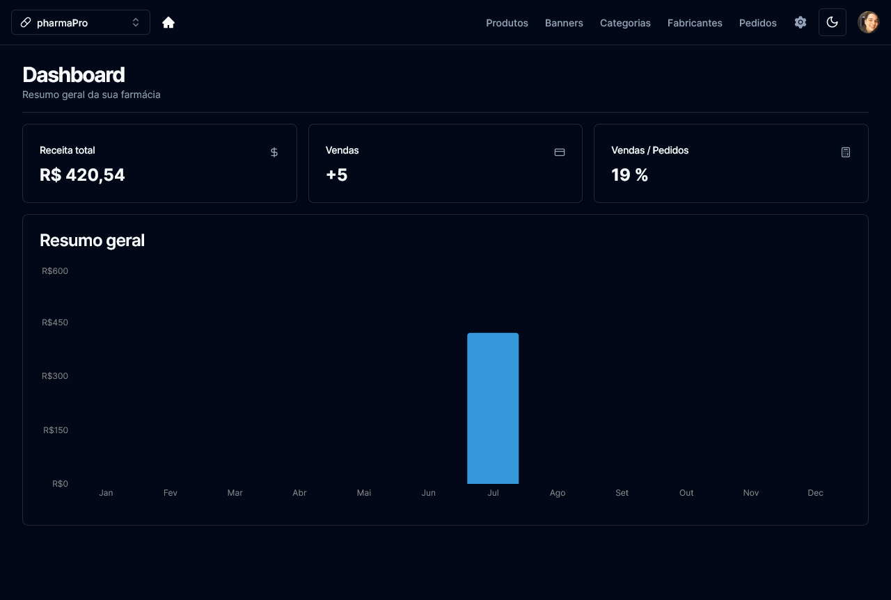

# pharmaPro Admin 


<p align="center">

</p>

> Gerenciador de e-commerce para farmácias

### Ajustes e melhorias

Projeto concluído!

- [x] Desenvolvimento de todo o projeto utilizando NextJS e Tailwind
- [x] Criação e consumo de REST API
- [x] Comunicação com a store do projeto [pharmaPro Store](https://github.com/gguilhermelopes/pharmapro-admin), gerenciando totalmente a loja em tempo real
- [x] Utilização do shadcn-ui para os estilos, contando com modo escuro
- [x] Implementação dos endpoints para a store, incluindo meio de pagamentos com Stripe
- [x] Login e criação de usuários com Clerk

## 💻 Pré-requisitos

Antes de começar, verifique se você atendeu aos seguintes requisitos:

* Você instalou a versão mais recente de `Node.js` e `npm`.

## 🚀 Instalando pharmaPro Admin 

Para instalar o pharmaPro Admin , siga estas etapas:

* Clone esse repositório com `git clone https://github.com/gguilhermelopes/pharmapro-admin`
* Entre na pasta com `cd dogs`
* Instale as dependências com `npm install`
* É necessário um arquivo de váriaveis de ambiente (.env) como no exemplo abaixo

```
NEXT_PUBLIC_CLERK_PUBLISHABLE_KEY=clerk_publishable_key
CLERK_SECRET_KEY=secret_key
NEXT_PUBLIC_CLERK_SIGN_IN_URL=si
NEXT_PUBLIC_CLERK_SIGN_UP_URL=su
NEXT_PUBLIC_CLERK_AFTER_SIGN_IN_URL=/
NEXT_PUBLIC_CLERK_AFTER_SIGN_UP_URL=/
DATABASE_URL=database_url
STRIPE_API_KEY=stripe_key
FRONTEND_STORE_URL=frontend_url
STRIPE_WEBHOOK_SECRET=webhook_key
```


## ☕ Usando pharmaPro Admin

Para usar pharmaPro Admin, siga estas etapas:

* Certifique-se de que todas as dependências foram instaladas, que o arquivo .env esteja configurado corretamente e que esteja na pasta do projeto. Utilize `npm run dev` e veja em qual porta do seu ambiente local ele foi executado.
